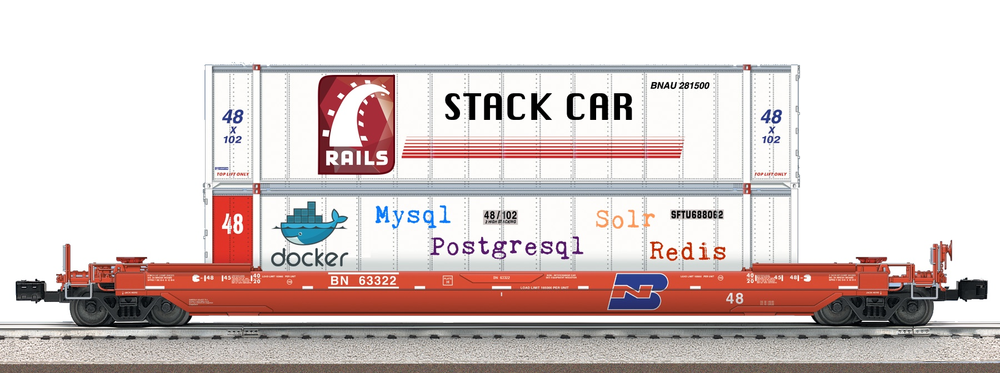

# StackCar



Stack Car is an opinionated set of tools around Docker and Rails.  It provides convenent methods to start and stop docker-compose, to deploy with rancher and a set of templates to get a new Rails app in to docker as quickly as possible.


## Installation

Because stack_car will be used to run your application in side of Docker, you want to install stack car in to your system Ruby instead of putting in your applications Gemfile

```bash
gem install stack_car 
```

## Usage

Commands are accesible via the "sc" short cut. Note: this will need to be in your command path in front of the spreadsheet command (sc), which is a fairly archaiac unix spreadsheet tool. We're guessing you don't edit a lot of spreadsheets in your terminal, but if you do, we also figure you can override your path order pretty easily.  Many of these commands have short versions or alias to make remembering them easier.  If there are obvious aliases missing, PRs are welcome.

```ruby
Commands:
  stack_car bundle_exec ARGS  # wraps docker-compose exec web bundle exec unless --service is used to specify (sc be ARGS)
  stack_car console ARGS      # shortcut to start rails console
  stack_car dockerize DIR     # Will copy the docker tempates in to your project, see options for supported dependencies
  stack_car exec ARGS         # wraps docker-compose exec web unless --service is used to specify
  stack_car help [COMMAND]    # Describe available commands or one specific command
  stack_car stop              # starts docker-compose with rebuild and orphan removal, defaults to all
  stack_car up                # starts docker-compose with rebuild and orphan removal, defaults to web
  stack_car walk ARGS         # wraps docker-compose run web unless --service is used to specify
```

## Development

After checking out the repo, run `bin/setup` to install dependencies. Then, run `rake spec` to run the tests. You can also run `bin/console` for an interactive prompt that will allow you to experiment.

To install this gem onto your local machine, run `bundle exec rake install`. To release a new version, update the version number in `version.rb`, and then run `bundle exec rake release`, which will create a git tag for the version, push git commits and tags, and push the `.gem` file to [rubygems.org](https://rubygems.org).

## Contributing

Bug reports and pull requests are welcome on Gitlab at https://gitlab.com/notch8/stack_car.

## TODO

- move .env files to dot style
- make .env secret by default
- update .gitlab to latest (see learn and ansur)

- Fill out readme
- Implement deploy
- Implement deploy templates
- Implement database dump and restore
- Implement secret sync
- Specs
